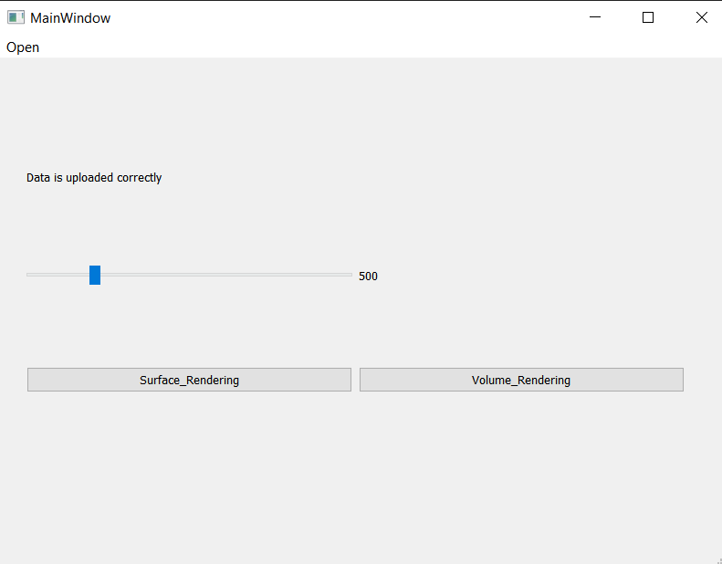
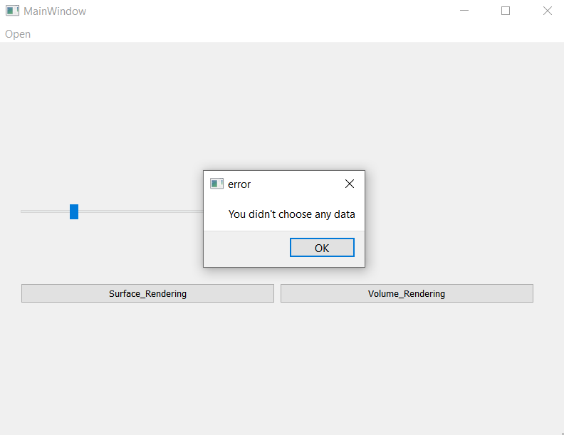
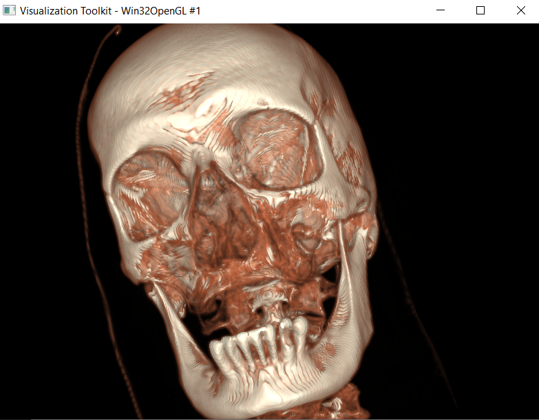
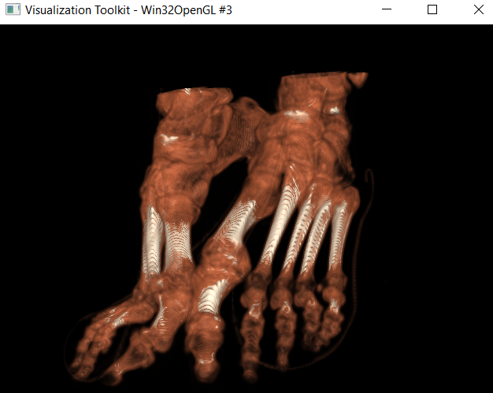
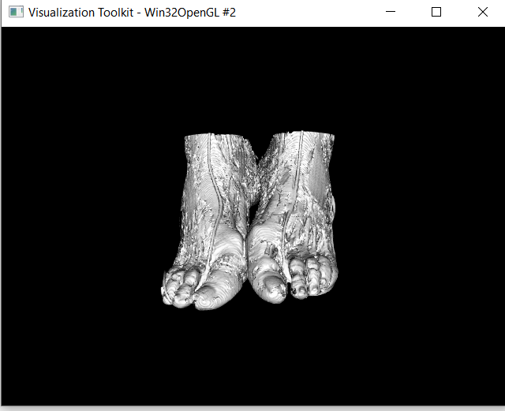
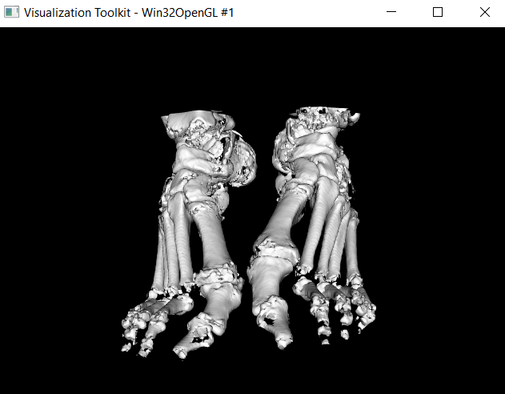
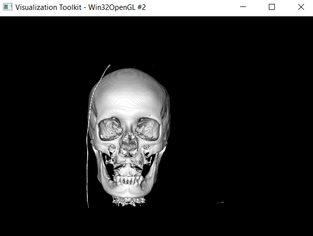
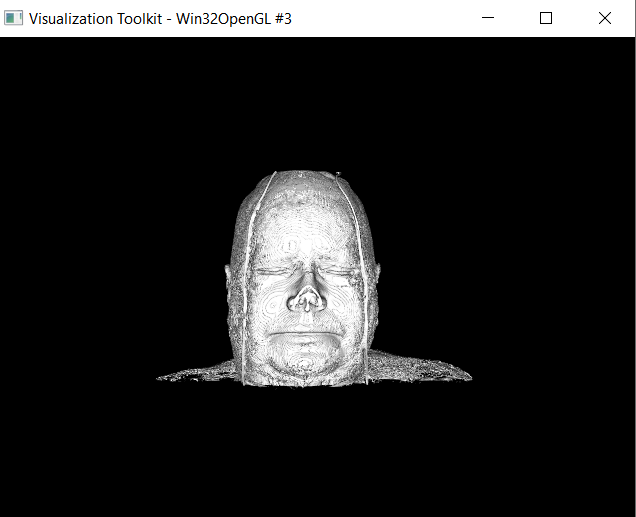

# Medical Visualization
## Results
1. GUI Format
    * Open: to load folder of dataset dynamically
    * Slider: to control IOS-value
    * Surface & Volume Rendering Buttons: to switch betwwen the two rendering techniques  

2. Error message in case of not choosing any folder

3. Sample Results of "Volume" Ray casting Rendering
   * Head

   * Ankel

4. Sample Results of Surface Rendering

   * Ankel in Different ISO-values

 

   * Head in Different ISO-values

 
